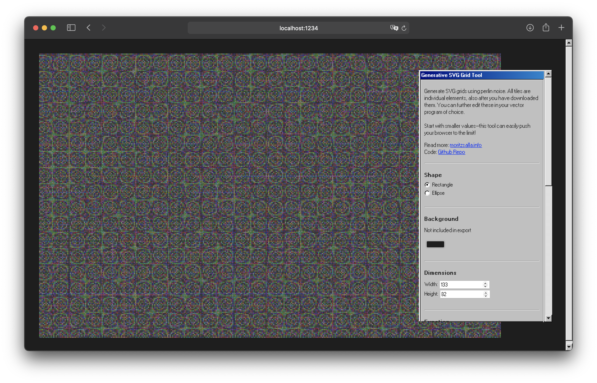
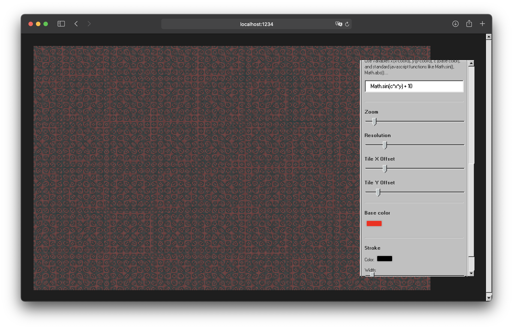

Program 1.0 (Perlin)

A browser-based design tool that lets you generate endless patterns using perlin noise. It can be used to generate funky grids that would otherwise be impossible to create by hand. The resulting design is composed of SVG objects, and can be downloaded for further editing in your vector program of choice.

The grid tool gives you access through the x axis, y axis, color, and various functions such as noise and randomness.You can swap the object shape between rectangle and elipse. The old fashioned UI is created with 98.css.

Generate your own designs here: https://grid-tool-vanilla.vercel.app. Be careful while exporting large and details patterns, they can get more complex than your vector program can handle 💣

